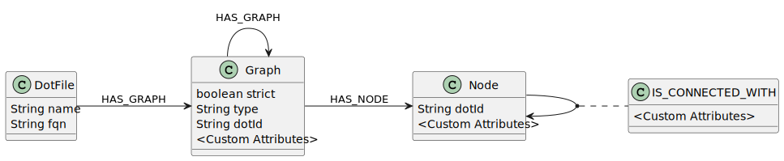

# jQAssistant plugin for the Graphviz DOT file format

This plugin accepts files with the `.dot` and `.gv` file extensions and puts the graph contained in those files into the neo4j database.

## Hot to install

### jQAssistant 1.12.0 and above 

Use the jqassistant.yaml as described [here](https://jqassistant.github.io/jqassistant/current/)
and add the following three lines in the plugins section:

```
    - group-id: de.kontext-e.jqassistant.plugin
      artifact-id: jqassistant.plugin.dot
      version: ${version}
```
Version 2.1.0 should be compatible with all jQAssistant versions 2.1.0 and above.

### Prior to jQAssistant 1.12

Download the desired version from maven
(e.g. [here](https://mvnrepository.com/artifact/de.kontext-e.jqassistant.plugin/jqassistant.plugin.asciidoc))
and put the jar in the jqassistant plugins directory.

## Datastructures



### `:Dot:Graph`-Node

Attributes:

| Name        | Description                                                                                           |
|-------------|-------------------------------------------------------------------------------------------------------|
| strict      | denotes whether the graph is strict (i.e. whether multi-edges are allowed)                            |
| type        | denotes the type of graph (graph, digraph or subgraph)                                                |
| dotId       | the ID of the dot node                                                                                |
| [attribute] | the labels and the values of any custom attributes. For each graph attribute one neo4j-node attribute |

Relations:

| Name      | Description                     |
|-----------|---------------------------------|
| HAS_NODE  | links to all nodes of the graph |
| HAS_GRAPH | links to all sub graphs         |


### `:Dot:Node`-Node

Attributes:

| Name        | Description                                                                                          |
|-------------|------------------------------------------------------------------------------------------------------|
| dotId       | the ID of the dot node                                                                               |
| [attribute] | the labels and the values of any custom attributes. For each node attribute one neo4j-node attribute |

Relations:

| Name              | Description                |
|-------------------|----------------------------|
| IS_CONNECTED_WITH | links to other graph nodes |

### `:IS_CONNECTED_WITH`-Relation

Connects two graph nodes. The attributes from the dotfile are added as attributes of this relation.

